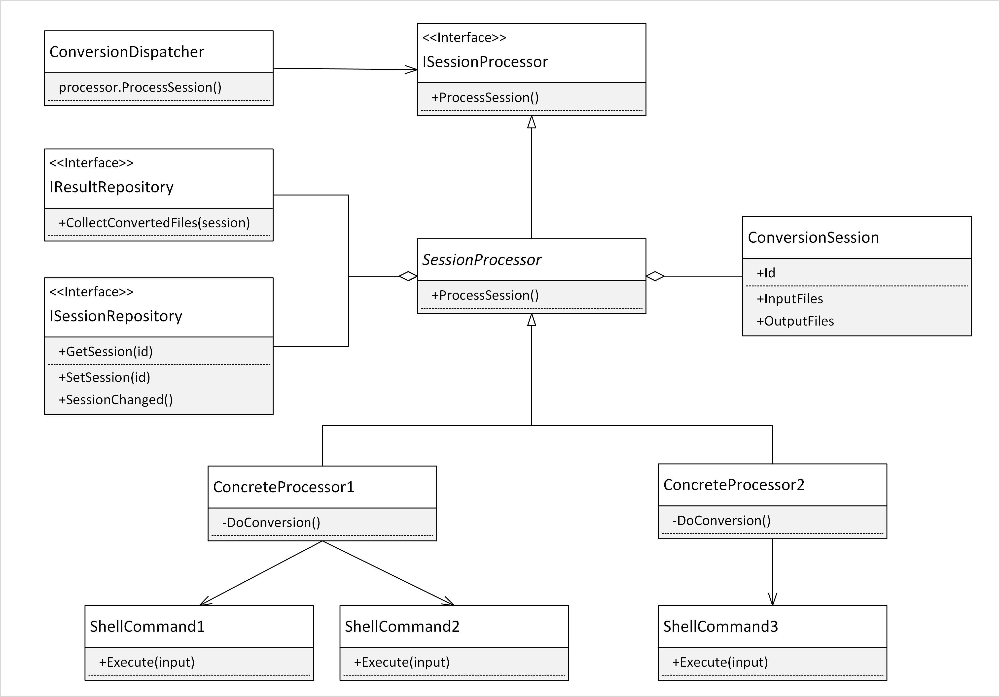
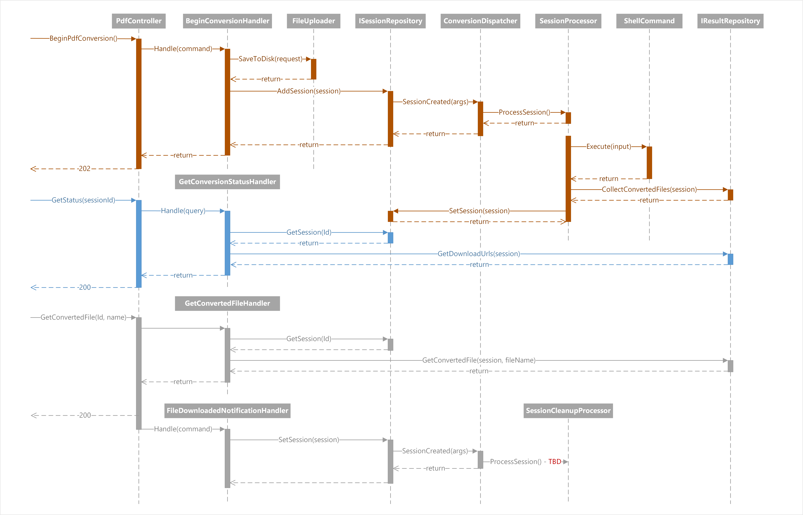

# LibreOffice PDF Conversion Service 
Royalty-free PDF conversion Web API service leveraging  capabilities of popular free and open source applications that can run in a Linux container, including but not limited to <a href="https://www.libreoffice.org/">LibreOffice suite</a>.

## Table of contents

  - [Functionality](#functionality)
  - [Prerequisites](#prerequisites)
  - [Quick Start](#quick-start)
  - [Architecture](#architecture)
    - [Session and Result Repositories](#session-and-result-repositories)
    - [PDF Conversion](#pdf-conversion)
    - [Interaction between Web API and Background Services](#interaction-between-web-api-and-background-services)
  - [Status](#status)
  - [Known Issues](#known-issues)

## Functionality

Service supports the following operations:

- Converting office documents and popular image formats to PDF:
  - Supports one or multiple documents per request.
  - The documents must be of supported file types, as specified in service configuration file.

- Merging multiple PDF and/or office documents and images into a single PDF document:
  - Supports multiple documents per request.
  - The documents must be of supported file types, as specified in service configuration file.

- Filling out and flattening fillable PDF forms using Forms Data Format (FDF) files:
  - Supports requests supplying one fillable PDF form and one FDF document.

- Generating an FDF template from a fillable PDF form:
  - Supports requests supplying one fillable PDF form.

All HTTP POST requests to the server must use `multipart/form-data` content type. In addition, the service does not support mixing files with form content and will throw an exception when this is the case.

## Prerequisites

In order to build the container with LibreOffice PDF Conversion Service you need to have the following installed:

- <a href="https://dotnet.microsoft.com/download">.NET 6.0 SDK</a>
- <a href="https://docs.docker.com/get-docker/">Docker</a>

The service is designed to run inside of a Linux container. The hosting environment must be running the conversion service in a container for the conversion to work.

## Quick Start

1. Clone this repository to your machine.
2. Navigate to the folder containing `Dockerfile`, ex. `.\dotnet\src\ConverterService`
3. Run `az acr build -t dsd-marine-lopdf:<tag> -r <acrname> .` where `<tag>` should be replaced by a value such as a build number, and `<acrname>` is the name of an existing Azure Container Registry instance.
4. Create Azure App Service and pull the image .

## Architecture

Conversion service uploads files into a file sysem inside of the Linux container it is running from, then it invokes conversion utilities on them by using Linux shell commands. If conversion operation succeeds then its resulting files are copied to a result repository, from where they can be downloaded by callers.

The following free open source software is used by the convesion service:
1. Convert files to PDF: <a href="https://www.libreoffice.org/">LibreOffice</a>
2. Merge multiple PDF documents into one PDF document: <a href="https://launchpad.net/ubuntu/+source/ghostscript/9.26~dfsg+0-0ubuntu0.14.04.8">ghostscript</a>
3. Manage fillable PDF forms: <a href="https://gitlab.com/pdftk-java/pdftk">pdftk-java</a>
4. Container OS: <a href="https://ubuntu.com/">Ubuntu</a>

### Session and Result Repositories

The central design idea of the service is passing conversion operation state (aka "conversion session") back and forth between Web API and background conversion dispatcher service through an instance of `ISessionRepository` whose responsibility is to retrieve and persist conversion sessions.

In addition, when a conversion session succeeds, converted files are collected into an instance of `IResultRepository`, from where they can be downloaded either directly or via an action on conversion service's own `PdfController`.

Conversion service has default implementations of these two repositories that work inside a container. In order to scale containers horizontally implementations of both `ISessionRepository` and `IResultRepository` need to rely on shared external data storage such as Azure Tables and Azure Blobs as an example. This will allow using load balancing requests for conversion status and for downloading conversion results across multiple container instances.

### PDF Conversion

Class diagram below illustrates key types involved in fulfilling of a conversion operation:

- `ConversionDispatcher` listens for session change events, creates and asynchronously invokes an implementation of `ISessionProcessor`.

- The `ISessionProcessor` and its implemetation, an abstract class `SessionProcessor` are central elements in the conversion processing. A session processor has all the context and knowledge to prepare, execute, collect results from and make a decision on success or failure of one or more `ShellCommand` instances. It is also responsible for updating `ISessionRepository` and `IResultRepository` accordingly.

- Concrete implementations of `SessionProcessor` have "expert knowledge" about executing respective conversion operations, and about how to manipulate one or multiple `ShellCommand` instances.

- Concrete implementations of `ShellCommand` (not shown itself on the diagram) abstract Linux processes with respective command line parameters, `stdout` and `stderr`.

- `ConversionSession` class instances represent persistable state of individual conversion instances. Conversion sessions are managed by conversion operations and queried by Web API status or download requests.

### Interaction between Web API and Background Services

The following diagram illustrates interactions that take place between components of the conversion service in response to a sample event sequence:
1. Uploading files to begin PDF conversion.
2. Checking status of conversion operation after its completion.
3. Downloading conversion results through a `PdfController` action.

## Status

This project is a concept demonstrator. The following aspects require attention:
   
1. For production use `ISessionRepository` and `IResultRepository` require implementations that rely on external data stores.

2. Cleanup mechanism needs to be implemented. At present `ConversionDispatcher` responds to `ResultsDownloaded` session state with a log message without actual implementation of a cleanup session processor.

3. The size of docker image containing Ubuntu and LibreOffice is quite large (1.9 GB). This is so primarily due to large space consumption by LibreOffice. The size of the image could be brought down by ~50% if a `--no-install-recommends` switch is used during LibreOffice installation. This may however have a negative impact on produced PDF quality, as fewer fonts are installed when this switch is used. The size of the docker images can and probably should be brought down drastically through a cycle of experimentation with reducing LibreOffice size and testing the PDF quality. Ubuntu itself could be replaced by a smaller base image.  

## Known Issues

1. When Application Insights is turned on for the Web App, it conflicts with the installed pdftk-java package.
2. Links to status and download endpoints have `http` scheme, while they should have `https`. This is due to Docker container configuration issues that need to be looked at. The same `Dockerfile` works fine when container image is built using docker CLI, but has this issue when it is built with ACR Tasks. <a href="https://docs.microsoft.com/en-us/aspnet/core/security/enforcing-ssl?view=aspnetcore-6.0&tabs=visual-studio#port-configuration">More info</a>
3. Timeouts on all conversion operations are set to 30 seconds and need to be increased to several minutes for slower operations.
4. Sometimes conversion failures are logged as information messages instead of as Error messages. Specifically this is the case when a call to a shell command times out.

 